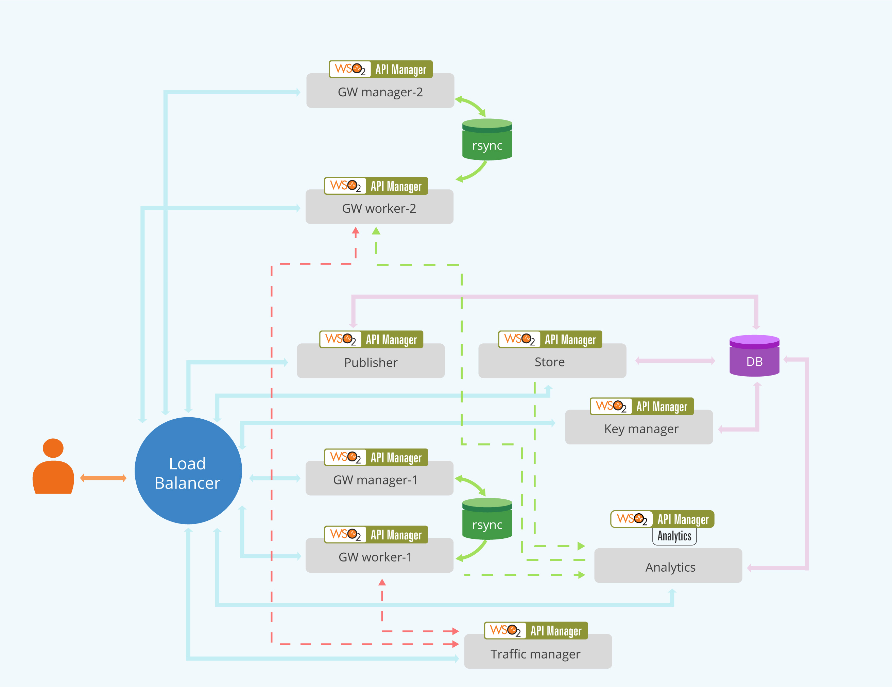

# WSO2 API Manager Pattern-4



This pattern consist of a fully distributed APIM setup (including a Gateway cluster of one manager and one worker)
with an additional Gateway Cluster (one manager and one worker) in a DMZ, with a single
wso2am-analytics server instance. The eight hiera data .yaml files (in spite of  common.yaml) here are for the 8 APIM nodes.
 The databases used in this pattern are external mysql databases.

Please follow the basic instructions in this [README](../../../../../README.md) before following this guide.

## Deployment.conf file

Content of /opt/deployment.conf file should be similar to below format to run the agent and setup the respective APIM
 node for this pattern. Please note to put the respective Hieradata .yaml file name, without extension to the
 **product_profile** parameter.

```yaml
 product_name=wso2am_runtime
 product_version=2.1.0
 product_profile=<hiera_file_name_without_extension>
 vm_type=openstack
 environment=dev
 platform=default
 use_hieradata=true
 pattern=pattern-4
```
e.g.:- To setup Gateway Manager node in the DMZ:

```yaml
 product_name=wso2am_runtime
 product_version=2.1.0
 product_profile=gateway-manager-dmz
 vm_type=openstack
 environment=dev
 platform=default
 use_hieradata=true
 pattern=pattern-4
```

## Node Details

Following table contains the APIM node instances with their respective hiera data .yaml file names and the host names
used in each instance.

   APIM Node           | Hieradata file            | Hostname
   -------------       |-----------------------    | ------------------
   Publisher           | api-publisher.yaml        | pub.dev.wso2.org
   Store               | api-publisher.yaml        | store.dev.wso2.org
   Gateway Manager-LAN | gateway-manager-lan.yaml  | mgt-gw.dev.wso2.org
   Gateway Worker-LAN  | gateway-worker-lan.yaml   | gw.dev.wso2.org
   Gateway Manager-DMZ | gateway-manager-dmz.yaml  | dmz-mgt-gw.dev.wso2.org
   Gateway Worker-DMZ  | gateway-worker-dmz.yaml   | dmz-gw.dev.wso2.org
   Key Manager         | api-key-manager.yaml      | km.dev.wso2.org
   Traffic Manager     | traffic-manager.yaml      | tm.dev.wso2.org

Hostname used for the Analytics Server : **analytics.dev.wso2.org**


## Update wka list for clusters in the deployment

There are 2 clusters in this deployment pattern. Required configurations are already added, but WKA IP addresses
should be updated in the respective hiera data files

1.Publisher-Store Cluster

This is a cluster of Publisher node and Store node.
Update the wka list in both api-publisher.yaml and store.yaml files with the IP addresses of Publisher and Store nodes.
```yaml
  wka:
    members:
      -
        hostname: 192.168.57.219
        port: 4000
      -
        hostname: 192.168.57.21
        port: 4000
```
2.Gateway Clusters

There are 2 Gateway clusters in this pattern. One is in the LAN and the other one is in the DMZ. Each of those clusters consist of a Gateway Manager node and a Gateway Worker node.
Required configurations are already added, but WKA IP addresses should be updated in the respective hiera data files

  * For the Gateway cluster in the LAN:
    -Update the wka list in both gateway-manager-lan.yaml and gateway-worker-lan.yaml files with the IP addresses of Gateway Manager node and Gateway Worker node in the LAN.

```yaml
  wka:
    members:
      -
        hostname: 192.168.57.216
        port: 4000
      -
        hostname: 192.168.57.247
        port: 4000
```

  * For the Gateway cluster in the DMZ:
    -Update the wka list in both gateway-manager-dmz.yaml and gateway-worker-dmz.yaml files with the IP addresses of Gateway Manager node and Gateway Worker node in the DMZ.

```yaml
  wka:
    members:
      -
        hostname: 192.168.57.5
        port: 4000
      -
        hostname: 192.168.57.218
        port: 4000
```
